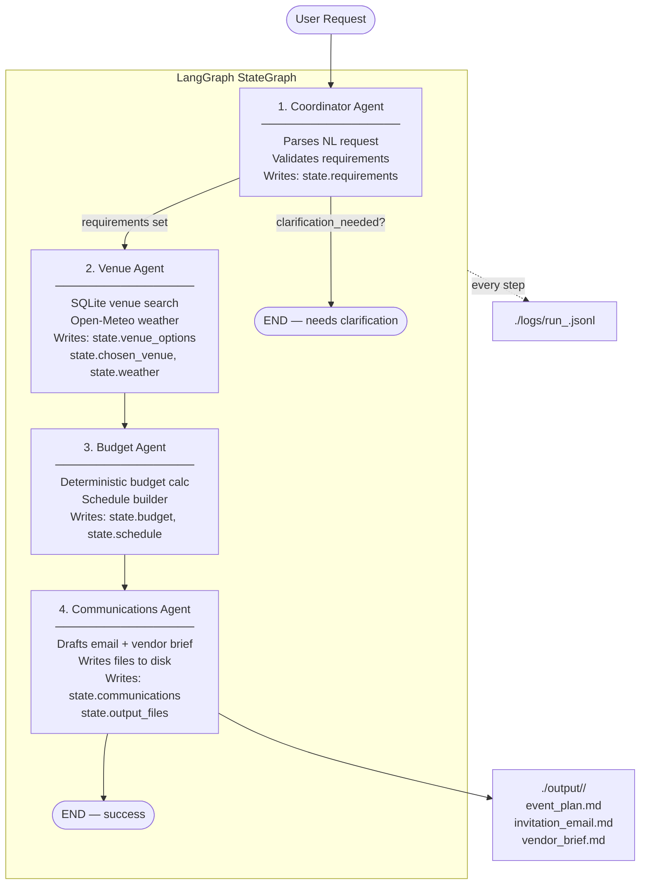

# Architecture

## Workflow Diagram



---

## Global State Contract

All agents share a single `EventState` TypedDict. Each agent reads upstream keys and writes only its own assigned keys.

```
EventState
├── user_request: str                         ← set at graph entry
├── trace_id: str                             ← set at graph entry
│
├── [Coordinator writes]
│   ├── requirements: EventRequirements
│   └── clarification_needed: list[str] | None
│
├── [Venue writes]
│   ├── venue_options: list[VenueRecommendation]
│   ├── chosen_venue: Venue
│   └── weather: WeatherInfo
│
├── [Budget writes]
│   ├── budget: BudgetBreakdown
│   └── schedule: list[ScheduleEntry]
│
└── [Communications writes]
    ├── communications: Communications
    └── output_files: list[str]
```

### Key Pydantic models

| Model | Owner | Purpose |
|-------|-------|---------|
| `EventRequirements` | Member 1 | Validated structured request |
| `Venue` | Member 2 | Single venue from DB (source="venue_db") |
| `WeatherInfo` | Member 2 | Open-Meteo forecast for event date |
| `VenueRecommendation` | Member 2 | Ranked venue with pros/cons |
| `BudgetBreakdown` | Member 3 | Balanced line-item budget |
| `ScheduleEntry` | Member 3 | Single run-of-show block |
| `Communications` | Member 4 | All three output documents |

See [../src/event_planner/state/event_state.py](../src/event_planner/state/event_state.py) for the canonical definitions.

---

## Technology Stack

| Layer | Choice | Notes |
|-------|--------|-------|
| Language | Python 3.11+ | Modern type hints required |
| LLM Engine | Ollama (`llama3.1:8b` / `phi3:mini`) | Local only, no API keys |
| Orchestrator | LangGraph | Explicit graph + typed state |
| LLM Client | `ollama` Python package | `format="json"` for structured output |
| Validation | Pydantic v2 | All tool I/O and state shape |
| Storage | SQLite (stdlib) | Local venue database |
| External API | Open-Meteo | Free, no key, weather forecasts |
| HTTP | `httpx` | Open-Meteo calls |
| Testing | `pytest` + `hypothesis` | Property-based tests |
| Logging | stdlib + custom JSONL tracer | Observability rubric |

---

## Tracer Event Schema

Each line in `./logs/run_<trace_id>.jsonl` is a JSON object:

```json
{
  "timestamp": "2026-05-15T10:30:00.123Z",
  "run_id": "abc123",
  "agent": "coordinator",
  "event_type": "tool_call",
  "tool_called": "validate_requirements",
  "inputs": { "raw_extraction": { "..." : "..." } },
  "outputs": { "ok": true },
  "latency_ms": 42,
  "error": null
}
```

`event_type` values: `agent_start`, `tool_call`, `agent_end`, `error`
